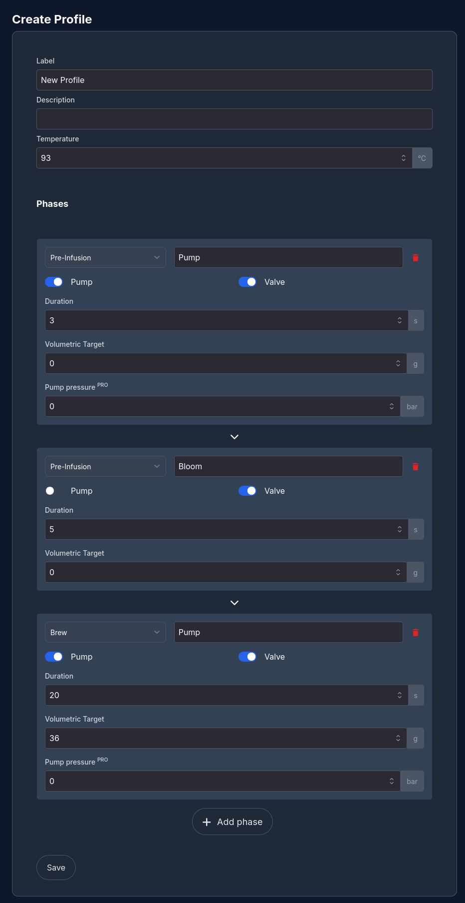

## Introduction

One of Gaggimate's primary features is its ability to create custom profiles for espresso brewing.
Profiles can be created and edited in the web UI on the [Profiles page](http://gaggimate.local/profiles).
Additionally, users can export existing profiles as JSON files, share these files online (see for example the [profiles channel](https://discord.com/channels/951416527721230336/1380352847387820082) on the Discord server), and import other users' profiles onto their own Gaggimate.
Once a profile is created or imported, it can be made available on the machine by favoriting it in the web UI.

A profile consists of one or more *phases*; steps that Gaggimate will execute until it reaches a volumetric target, up to some maximum duration.
Once the target weight is met or the maximum duration is exceeded, Gaggimate will continue to the next phase, or, if there are none left, finish the brew.
Alternately, if the user wishes to stop a brew early, they can simply terminate it manually, either with the on-screen controls, or, if they wired them up, with the physical brew button.

Volumetric targets work best when a Bluetooth scale is used.
If not, Gaggimate will estimate the amount of coffee in the cup based on the pressure curve of the brew up to that point.
Volumetric targets can alternatively have a value of zero grams, in which case this target is treated as infinite and the phase simply runs for the maximum duration of that phase.

During a phase, the machine's pump may be on or off, and the three-way valve may be open or closed.
Users of Gaggimate Pro may also configure the pump to run at a specific pressure, to which it is tuned using the pressure transducer.
For brew recipes, the three-way valve typically remains closed, but opening it can be useful in certain cases, such as for a profile for backflushing.

A profile currently has a single target temperature across all phases. The ability to set declining temperature targets will be coming with the advanced profiles.

## Creating a simple profile

Let's now create a simple profile using the web UI, and see what the corresponding JSON file looks like.
You can also manually write the profiles as JSON files and then import them into Gaggimate if you prefer.

### Using the web UI
At the bottom of the "Profiles" page in the web UI, click "Add new" at the bottom of the page, then select "Simple profile".
Advanced profiles featuring temperature gradients and transitions will follow soon.
We are then presented with the following blank profile:



This will create a profile that performs a three second fill, then a 5 second pre-infusion, and then brew until 36 grams of coffee has been brewed.
The temperature target is 93 °C.
Every phase can be given a descriptive name, which will be shown on the machine's display during the brew.

Save the profile.
When we now return to the page with all profiles, the new profile will appear in the list.
However, it is not yet available on the machine itself.
In order to do so, click the left star icon on the profile to make it available on the machine.
You are now ready to brew some coffee.

### The JSON format

By exporting the profile we just created and looking at the contents of the JSON file, the structure of these profiles will become apparent:

```json
{
  "label": "New Profile",
  "type": "standard",
  "description": "",
  "temperature": 93,
  "phases": [
    {
      "name": "Pump",
      "phase": "preinfusion",
      "valve": 1,
      "duration": 3,
      "pump": 100
    },
    {
      "name": "Bloom",
      "phase": "preinfusion",
      "valve": 1,
      "duration": 5,
      "pump": 0
    },
    {
      "name": "Pump",
      "phase": "brew",
      "valve": 1,
      "duration": 20,
      "pump": 100,
      "targets": [
        {
          "type": "volumetric",
          "value": 36
        }
      ]
    }
  ]
}
```
