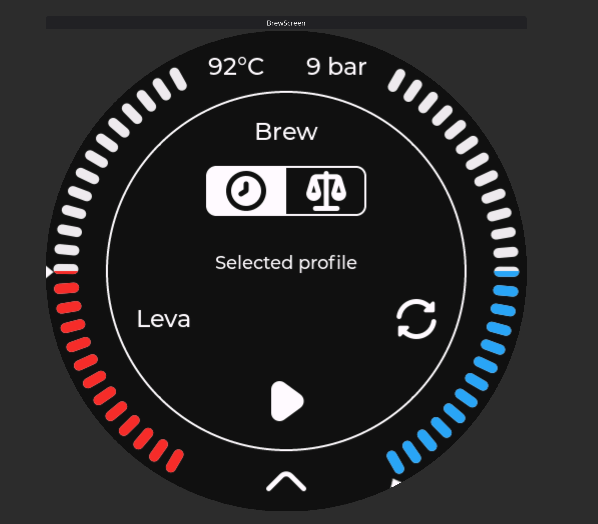
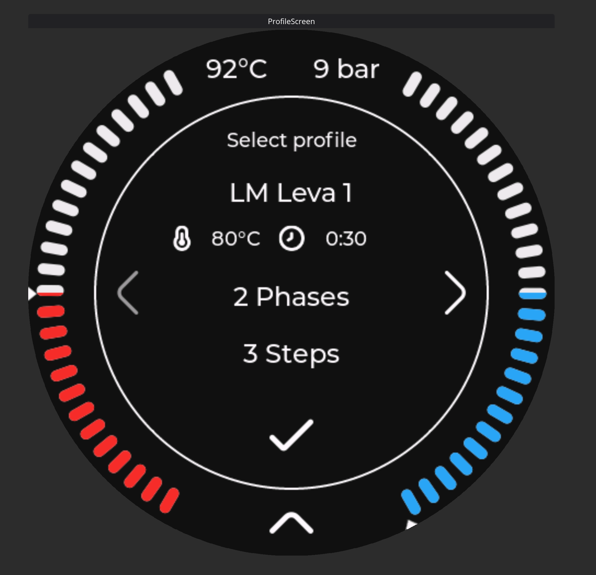
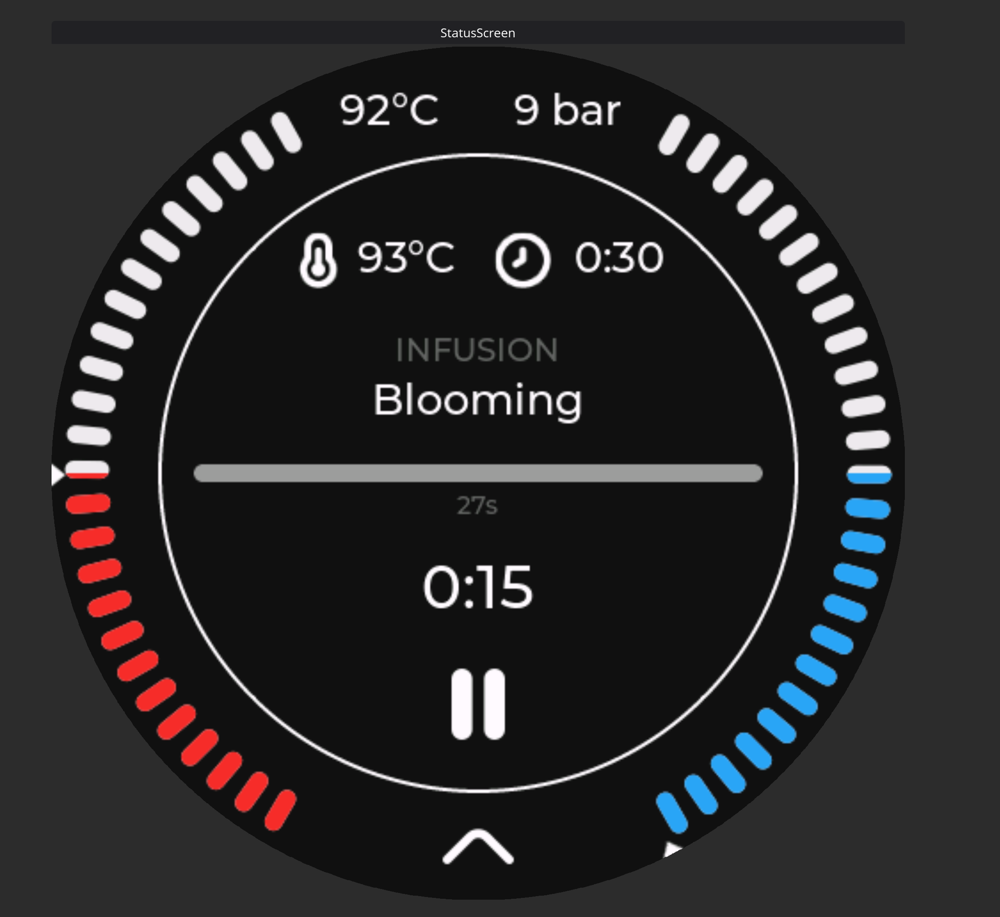
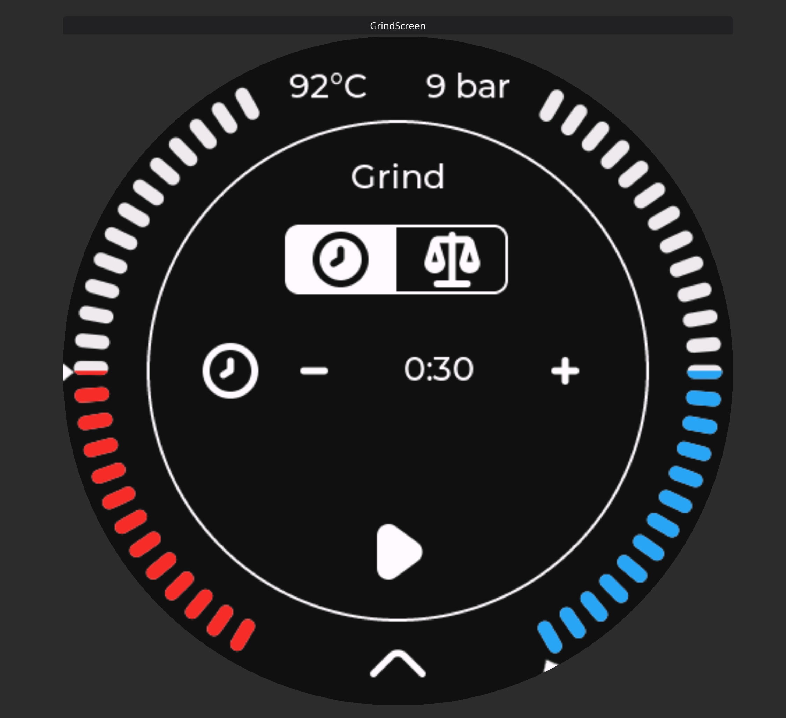

## 📘 Table of content.

- [GaggiMate Starting Screen](#gaggimate-starting)
- [Standby Screen](#standby-screen)
- [Main Menu](#main-menu)
- [Brew Screen](#brew-screen)
- [Profile Selection Screen](#profile-selection-screen)
- [Active Brew Screen](#active-brew-screen)
- [Steam Screen](#steam-screen)
- [Water Screen](#water-screen)
- [Grinder Screen](#grinder-screen)

---

Now everything is setup, and ready to go. But what are all these shiny new things on my display? Let me walk you through them.

### GaggiMate Starting...

This will be the very first screen you ever see with your GaggiMate screen.

It is shown when the screen starts up, and will stay this way until a bluetooth connection with the controller PCB has been made.

### Standby screen

This screen is the standby screen, this will be shown when there is a connection to the controller PCB, and the GaggiMate system is in standby mode, meaning that the heater and pump is turned off.

This screen has 3 possible logos in the top section. I'll explain each, going from left to right.

- Wifi symbol. If present, the GaggiMate is connected to a wifi connection, hopefully yours?!
- Bluetooth icon. This icon is shown when the screen has a bluetooth connection to the Controller PCB.
- Update icon. This signifies that there is an update available to either the screen, the controller PCB or both. It will only appear if the screen is connected to the internet.

The clock will be set automaticlly, but you might have to visit the settings page to set the right timezone for you, unless you prefer Italian Espresso Time to be your timezone.

When you touch the screen in this mode, it will switch to brew mode.

### Main menu

The main menu is used to navigate the different modes that GaggiMate offers.

This screen has one or two gauges around the menu menus. On the Standard version of the GaggiMate system, you will have 1 gauge showing temperature. On the Pro numeric you will have 2, the left one being temperature, and the right one being pressure. In both cases you will have a numeric value of the gauge/gauges current reading.

In the bottom of the screen you will have a power-botton symbol, if you press this, your GaggiMate system will enter Standby mode.
In the middle of the screen you will have 4 symbols in 2 rows.

- **Top row**
  - Brew mode, on the left.
  - Steam mode, on the right.
- **Bottom row**
  - Water mode, on the left.
  - Grinder mode, on the right.

You can click on either of the symbols to enter that mode.

### Brew screen

This is the brew screens start image, some information on this screen changes depending on the board type (Standard or Pro) as well as if you have a scale connected to your gaggimate or not.

This screen has one or two gauges around the main information area. On the Standard version of the GaggiMate system, you will have 1 gauge showing temperature. On the Pro numeric you will have 2, the left one being temperature, and the right one being pressure. In both cases you will have a numeric value of the gauge/gauges current reading.

In the top part of the middle section, you have what mode you are in, in this case Brew.

Next next section is dependent on a connection to a scale. If you dont have one connected to GaggiMate, this section will not be visible. If it is not visible, you will automaticly be in "Brew by time" mode.

The two buttons are:

- Brew by time (watch)
- Brew by weight (scale)

Below this you will have the selected profile that you are going to brew, as well as a symbol that you can click to go into profile selection.

Lastly in the middle section, you have a play button. This button has got 2 functions.

- Click to brew
- Hold to purge

If you short click the button, it will start the selected brew and move to the [Active Brew Screen](#active-brew-screen).

If you hold the button, it will purge the brewhead, useful for flushing the portafilter or the showerscreen with hot water.

In the very bottom you have an arrow up symbol, if you swipe up from this, it will take you to the main menu.

### Profile selection screen

If you clicked on the profile selection button on the brew screen, you will end up here.

This screen will hold all profiles that are favorited on the web interfaces profile page.
If you look through the profiles, and dont find the profile you expected, then it might be because it is not favorited on the web interface, and you will need to do this first, or change the active profile on the web interface if you just want to brew a one off on a non-favorited profile.

This screen has one or two gauges around the main information area. On the Standard version of the GaggiMate system, you will have 1 gauge showing temperature. On the Pro version you will have 2, the left one being temperature, and the right one being pressure. In both cases you will have a numeric value of the gauge/gauges current reading.

In the top part of the middle section, you have what screen you are on, in this case Profile selection.

Next you will have information about the current profile.

- Name of the profile
- Target temperature
- Target time
- How many phases the brew has got
- How many steps are in these phases.

On either side of this information you might have arrows pointing left and/or right. This means there are more profiles to choose from. You can either click those, or swipe in either direction to choose the next or previous profile in the list.

On the bottom of the middle section, you have a checkmark. You can click this to indicate that you want to select the shown profile.

In the very bottom you have an arrow up symbol, if you swipe up from this, it will take you to the main menu.

### Active brew screen

Once you start your brew, you will be met with some information about the current state of the brew.

This screen has one or two gauges around the main information area. On the Standard version of the GaggiMate system, you will have 1 gauge showing temperature. On the Pro version you will have 2, the left one being temperature, and the right one being pressure. In both cases you will have a numeric value of the gauge/gauges current reading.

In the middle section, you will have information about the brew happening.

On top you have target information, with the temperature target being the first, and the time target being the second information.

If you go down a bit further, you have a line that shows what phase the brew is currently in.

Just under the phase, you have the active step. This line holds the label you have put on this step of the brew when you made the profile in the Profile editor on the web interface.

You will then have a progress bar, showing the progress of the current step as well as the target that this bar represents just below.

Under the bar you have a active timer, showing you how far along the timeline for the step you are.

Lastly in the middle you have a pause symbol, this aborts the current brew and sends you back to the Brew screen described previously.

In the very bottom you have an arrow up symbol, if you swipe up from this, it will take you to the main menu.

### Steam screen

The steam screen doesnt show much info, since all that really is needed is temperature control, and a possiblity to activate the pump to improve the steam output.

This screen has one or two gauges around the main information area. On the Standard version of the GaggiMate system, you will have 1 gauge showing temperature. On the Pro numeric you will have 2, the left one being temperature, and the right one being pressure. In both cases you will have a numeric value of the gauge/gauges current reading.

In the middle section you will find 3 different rows of information.

The top row shows what screen you are on, steam in this case.

The second shows the current target temperature for your steam setting, as well as a plus and minus icon that lets you adjust the steam target temperature.

On the third and last line on the screen you have the play button, that will activate the improved steam method, that will pump a bit of water into the boiler during the steaming process to increase pressure and the amount of water available to create steam.

In the very bottom you have an arrow up symbol, if you swipe up from this, it will take you to the main menu.

### Water screen

Do you fancy a tea? Or maybe just a bit of water for an americano? In that case you would need hot water, and GaggiMate got you covered here, with the water mode.
The screen looks very similar as steam, since it is very much the same controls you need here.

This screen has one or two gauges around the main information area. On the Standard version of the GaggiMate system, you will have 1 gauge showing temperature. On the Pro numeric you will have 2, the left one being temperature, and the right one being pressure. In both cases you will have a numeric value of the gauge/gauges current reading.

In the middle section you will find 3 different rows of information.

The top row shows what screen you are on, water in this case.

The second shows the current target temperature for your water setting, as well as a plus and minus icon that lets you adjust the water target temperature.

On the third and last line on the screen you have the play button, that will activate the water mode.

In the very bottom you have an arrow up symbol, if you swipe up from this, it will take you to the main menu.

### Grinder screen

Did you want grinder with grind by weight, but ended up elsewhere? You are in luck, because gaggimate mated with a tasmota, gives you exactly that.

All you need for this feature is a grinder and a tasmota power socket, and preferably also a vale.

This screen has one or two gauges around the main information area. On the Standard version of the GaggiMate system, you will have 1 gauge showing temperature. On the Pro numeric you will have 2, the left one being temperature, and the right one being pressure. In both cases you will have a numeric value of the gauge/gauges current reading. This information is not something you would need to worry too much about while grinding.

In the middle section you will find a few pieces of information used for the grind feature.

On top you will find the screen mode, Grind on this screen.

Just below the mode, you will only see something if you have a bluetooth scale connected to your GaggiMate. If you have a scale connected, you can chose between Grind by time (watch logo) or Grind by weight (scale logo).
If you have chosen grind by time, your next line will show for how long the grinder should run once you click the play button.
If you have a connected scale, this screen will have the possibility to set that amount of grams it should produce before turning the grinder off.

Lastly on the screen, you have a play button, that activates the grinder mode.
