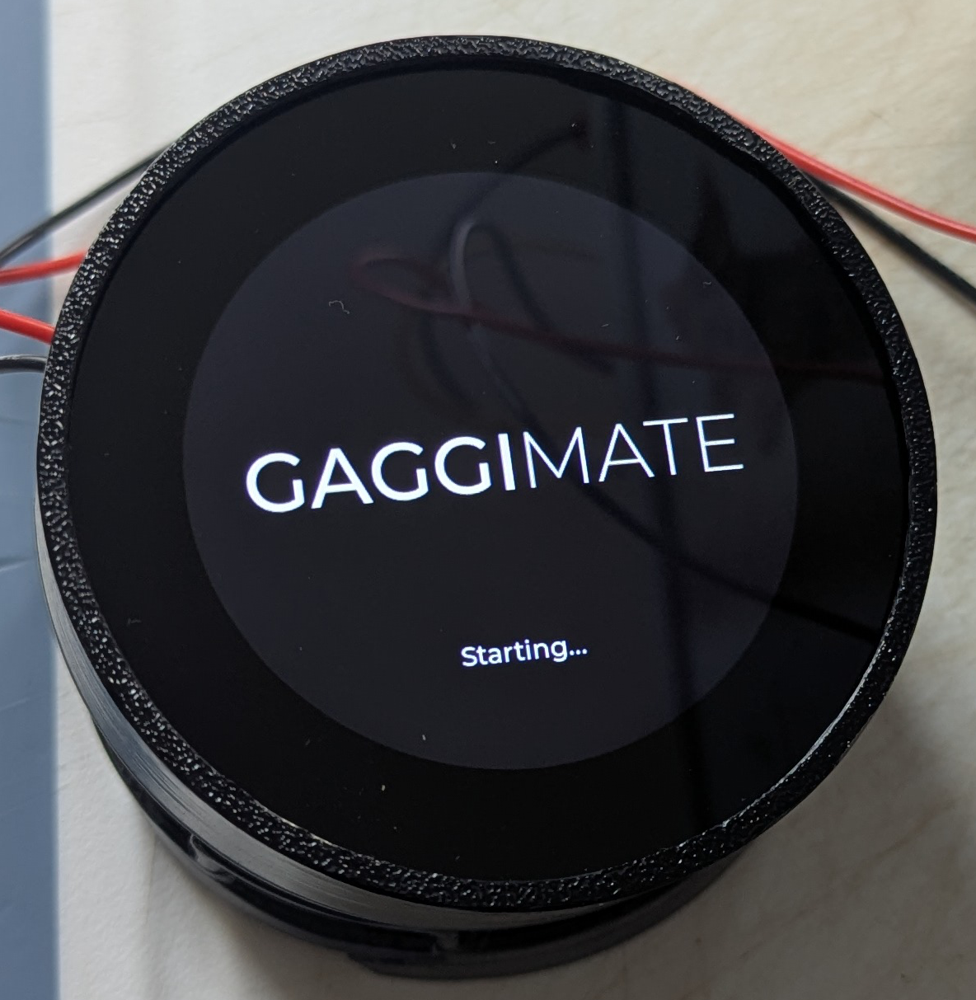
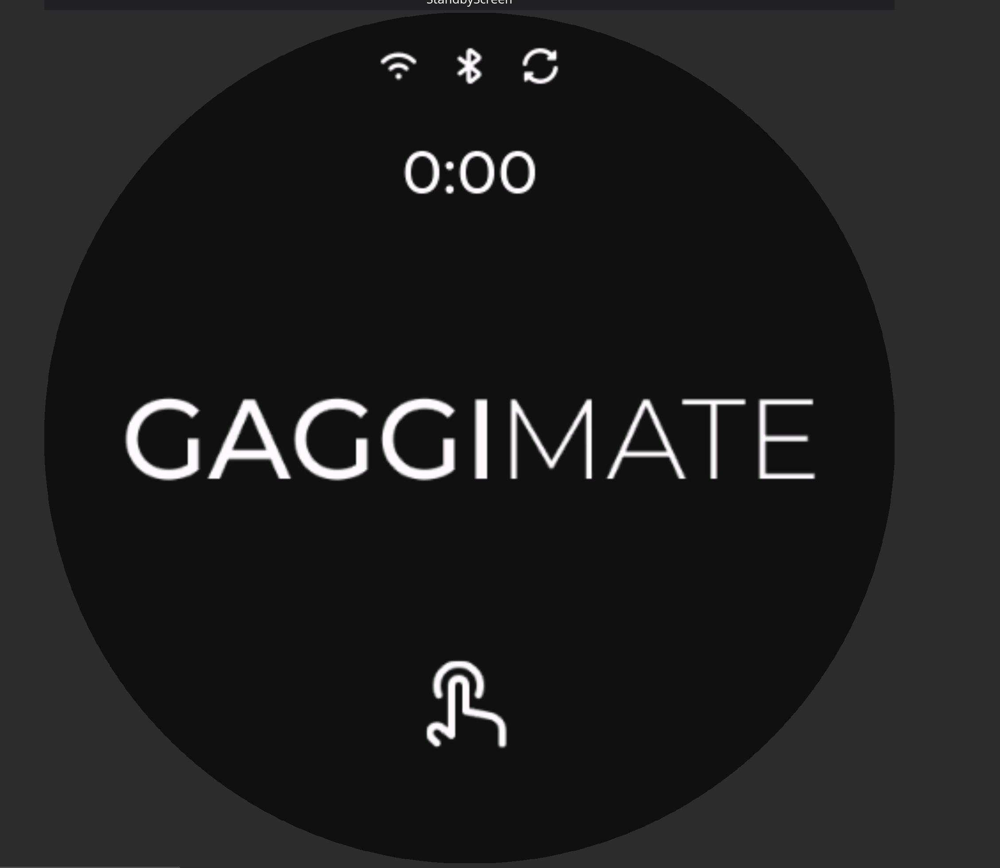
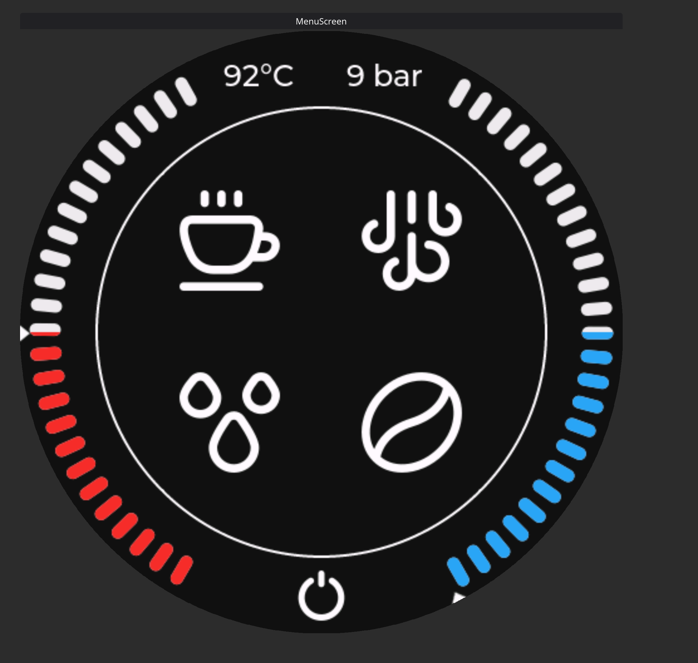
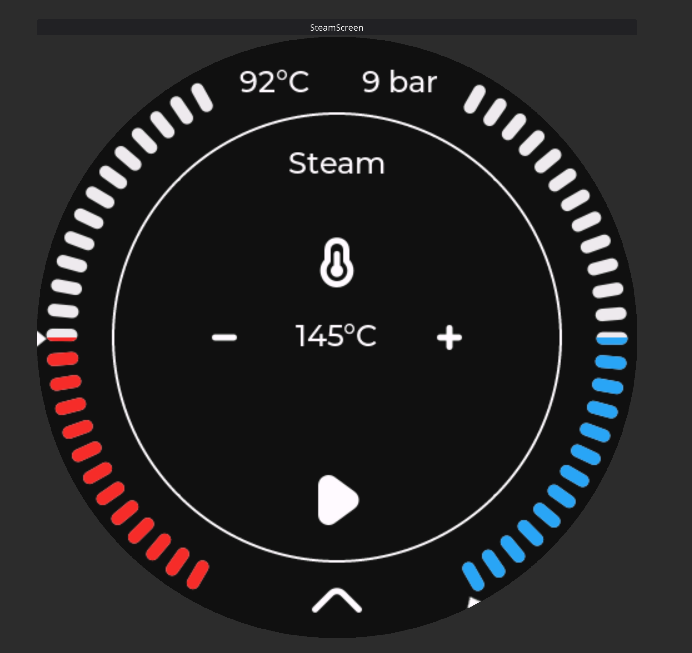

## 📘 Indice dei contenuti

- [Schermata di avvio GaggiMate](#gaggimate-in-avvio)
- [Schermata di standby](#schermata-di-standby)
- [Menu principale](#menu-principale)
- [Schermata di erogazione](#schermata-di-erogazione)
- [Schermata di selezione profilo](#schermata-di-selezione-profilo)
- [Schermata di erogazione attiva](#schermata-di-erogazione-attiva)
- [Schermata vapore](#schermata-vapore)
- [Schermata acqua](#schermata-acqua)
- [Schermata macinacaffè](#schermata-macinacaffè)

---

Ora tutto è configurato ed è pronto all'uso. Ma cosa sono tutte queste nuove e luccicanti cose sul mio display? Ti accompagno io a scoprirle.

### GaggiMate in avvio...

Questa è la primissima schermata che vedrai con lo schermo GaggiMate.

Viene mostrata all'accensione dello schermo e rimane così finché non viene stabilita una connessione Bluetooth con la scheda di controllo (Controller PCB).

### Schermata di standby

Questa è la schermata di standby. Viene mostrata quando c'è una connessione con il Controller PCB e il sistema GaggiMate è in modalità standby, cioè con resistenza e pompa spente.

In alto possono apparire 3 possibili icone. Te le spiego da sinistra a destra.

- Simbolo Wi‑Fi. Se presente, GaggiMate è connesso a una rete Wi‑Fi (speriamo la tua!).
- Icona Bluetooth. Viene mostrata quando lo schermo è connesso via Bluetooth al Controller PCB.
- Icona aggiornamento. Indica che è disponibile un aggiornamento per lo schermo, per il Controller PCB o per entrambi. Compare solo se lo schermo è connesso a Internet.

L'orologio viene impostato automaticamente, ma potresti dover visitare la pagina Impostazioni per configurare il fuso orario corretto, a meno che tu non preferisca come fuso l'Italian Espresso Time.

Toccando lo schermo in questa modalità, si passa alla modalità erogazione.

### Menu principale

Il menu principale serve per navigare tra le diverse modalità offerte da GaggiMate.

Questa schermata ha uno o due indicatori (gauge) attorno all'area dei menu. Nella versione Standard di GaggiMate è presente un solo indicatore per la temperatura. Nella versione Pro sono presenti due indicatori: a sinistra la temperatura, a destra la pressione. In entrambi i casi, è mostrato anche il valore numerico della/le misura/e corrente/i.

Nella parte bassa dello schermo c'è il simbolo di accensione: premendolo, il sistema GaggiMate entra in modalità Standby.
Al centro dello schermo ci sono 4 simboli disposti su 2 righe.

- **Riga superiore**
  - Modalità Erogazione, a sinistra.
  - Modalità Vapore, a destra.
- **Riga inferiore**
  - Modalità Acqua, a sinistra.
  - Modalità Macinacaffè, a destra.

Puoi toccare uno qualsiasi dei simboli per entrare in quella modalità.

### Schermata di erogazione

Questa è la schermata iniziale della modalità erogazione. Alcune informazioni visualizzate dipendono dal tipo di scheda (Standard o Pro) e dal fatto che tu abbia o meno una bilancia collegata a GaggiMate.

Questa schermata ha uno o due indicatori attorno all'area informativa principale. Nella versione Standard c'è un indicatore per la temperatura. Nella versione Pro due: a sinistra la temperatura, a destra la pressione. In entrambi i casi è mostrato anche il valore numerico della/le misura/e corrente/i.

Nella parte alta della sezione centrale è indicata la modalità attuale, in questo caso Erogazione.

La sezione successiva dipende dalla presenza di una bilancia. Se non ne hai una collegata a GaggiMate, questa sezione non sarà visibile. Se non è visibile, sarai automaticamente in modalità "Erogazione per tempo".

I due pulsanti sono:

- Erogazione per tempo (orologio)
- Erogazione per peso (bilancia)

Sotto trovi il profilo selezionato con cui erogherai, oltre a un simbolo su cui puoi toccare per entrare nella selezione dei profili.

Infine, nella sezione centrale, c'è un pulsante Play che ha 2 funzioni:

- Tocca per erogare
- Tieni premuto per purgare

Con un tocco breve si avvia l'erogazione selezionata e si passa alla [Schermata di erogazione attiva](#schermata-di-erogazione-attiva).

Teniendolo premuto si effettua la purga del gruppo, utile per sciacquare il portafiltro o la doccetta con acqua calda.

Nella parte più bassa c'è un simbolo a freccia verso l'alto: se scorri verso l'alto da qui torni al menu principale.

### Schermata di selezione profilo

Se hai toccato il pulsante di selezione profilo nella schermata di erogazione, arrivi qui.

Questa schermata mostra tutti i profili che hai contrassegnato come preferiti nella pagina Profili dell'interfaccia web.
Se passando tra i profili non trovi quello che ti aspettavi, potrebbe non essere tra i preferiti sull'interfaccia web: contrassegnalo prima come preferito, oppure cambia il profilo attivo dall'interfaccia web se vuoi fare un'erogazione singola con un profilo non preferito.

Questa schermata ha uno o due indicatori attorno all'area informativa principale. Nella versione Standard c'è un indicatore per la temperatura. Nella versione Pro due: a sinistra la temperatura, a destra la pressione. In entrambi i casi è mostrato anche il valore numerico della/le misura/e corrente/i.

Nella parte alta della sezione centrale è indicata la schermata in uso, in questo caso Selezione profilo.

Segue l'informazione relativa al profilo corrente:

- Nome del profilo
- Temperatura target
- Tempo target
- Quante fasi ha l'erogazione
- Quanti step ci sono in queste fasi

Sui lati di queste informazioni potresti vedere frecce verso sinistra e/o destra: significa che ci sono altri profili tra cui scegliere. Puoi toccare le frecce o scorrere in una delle due direzioni per scegliere il profilo precedente o successivo nell'elenco.

Nella parte bassa della sezione centrale c'è un segno di spunta: toccalo per indicare che vuoi selezionare il profilo mostrato.

Nella parte più bassa c'è un simbolo a freccia verso l'alto: se scorri verso l'alto da qui torni al menu principale.

### Schermata di erogazione attiva

Una volta avviata l'erogazione, vedrai alcune informazioni sullo stato corrente.

Questa schermata ha uno o due indicatori attorno all'area informativa principale. Nella versione Standard c'è un indicatore per la temperatura. Nella versione Pro due: a sinistra la temperatura, a destra la pressione. In entrambi i casi è mostrato anche il valore numerico della/le misura/e corrente/i.

Nella sezione centrale trovi le informazioni sull'erogazione in corso.

In alto ci sono i target: prima la temperatura target, poi il tempo target.

Più in basso c'è una riga che indica in quale fase dell'erogazione ti trovi.

Sotto la fase, trovi lo step attivo. Questa riga riporta l'etichetta che hai assegnato a questo step quando hai creato il profilo nell'Editor profili dell'interfaccia web.

Segue una barra di avanzamento che mostra il progresso dello step corrente e, subito sotto, il target a cui la barra si riferisce.

Sotto la barra c'è un timer attivo che mostra in che punto della timeline dello step ti trovi.

Infine, al centro, c'è un simbolo di pausa: interrompe l'erogazione corrente e ti riporta alla schermata Erogazione descritta in precedenza.

Nella parte più bassa c'è un simbolo a freccia verso l'alto: se scorri verso l'alto da qui torni al menu principale.

### Schermata vapore

La schermata Vapore non mostra molte informazioni, perché ciò che serve davvero è il controllo della temperatura e la possibilità di attivare la pompa per migliorare l'erogazione del vapore.

Questa schermata ha uno o due indicatori attorno all'area informativa principale. Nella versione Standard c'è un indicatore per la temperatura. Nella versione Pro due: a sinistra la temperatura, a destra la pressione. In entrambi i casi è mostrato anche il valore numerico della/le misura/e corrente/i.

Nella sezione centrale trovi 3 righe di informazioni.

La riga superiore indica la schermata in uso, in questo caso Vapore.

La seconda riga mostra la temperatura target del vapore, con le icone più e meno per regolarla.

Sulla terza e ultima riga c'è il pulsante Play, che attiva il metodo vapore migliorato: durante la montatura viene pompata una piccola quantità d'acqua nella caldaia per aumentare la pressione e la quantità di acqua disponibile a generare vapore.

Nella parte più bassa c'è un simbolo a freccia verso l'alto: se scorri verso l'alto da qui torni al menu principale.

### Schermata acqua

Ti va un tè? O magari un po' d'acqua per un americano? In tal caso serve acqua calda e GaggiMate ti aiuta con la modalità Acqua.
La schermata è molto simile a quella del vapore, perché i controlli necessari sono praticamente gli stessi.

Questa schermata ha uno o due indicatori attorno all'area informativa principale. Nella versione Standard c'è un indicatore per la temperatura. Nella versione Pro due: a sinistra la temperatura, a destra la pressione. In entrambi i casi è mostrato anche il valore numerico della/le misura/e corrente/i.

Nella sezione centrale trovi 3 righe di informazioni.

La riga superiore indica la schermata in uso, in questo caso Acqua.

La seconda riga mostra la temperatura target dell'acqua, con le icone più e meno per regolarla.

Sulla terza e ultima riga c'è il pulsante Play, che attiva la modalità Acqua.

Nella parte più bassa c'è un simbolo a freccia verso l'alto: se scorri verso l'alto da qui torni al menu principale.

### Schermata macinacaffè

Volevi una macinacaffè con macinatura a peso ma hai scelto altro? Sei fortunato, perché GaggiMate abbinato a Tasmota ti offre proprio questo.

Tutto ciò che serve è un macinacaffè e una presa smart Tasmota e, preferibilmente, anche una valvola.

Questa schermata ha uno o due indicatori attorno all'area informativa principale. Nella versione Standard c'è un indicatore per la temperatura. Nella versione Pro due: a sinistra la temperatura, a destra la pressione. In entrambi i casi è mostrato anche il valore numerico della/le misura/e corrente/i. Queste informazioni, durante la macinatura, non sono particolarmente rilevanti.

Nella sezione centrale trovi alcune informazioni utili per la funzione macinatura.

In alto trovi la modalità della schermata, Macina in questo caso.

Poco sotto vedi qualcosa solo se hai una bilancia Bluetooth collegata a GaggiMate. Se presente, puoi scegliere tra Macina per tempo (icona orologio) o Macina per peso (icona bilancia).
Se scegli la macinatura per tempo, la riga successiva mostra per quanto tempo il macinino deve funzionare dopo aver toccato Play.
Se hai una bilancia collegata, puoi impostare quanti grammi produrre prima che il macinino si spenga automaticamente.

Infine, c'è il pulsante Play che attiva la modalità macinacaffè.
